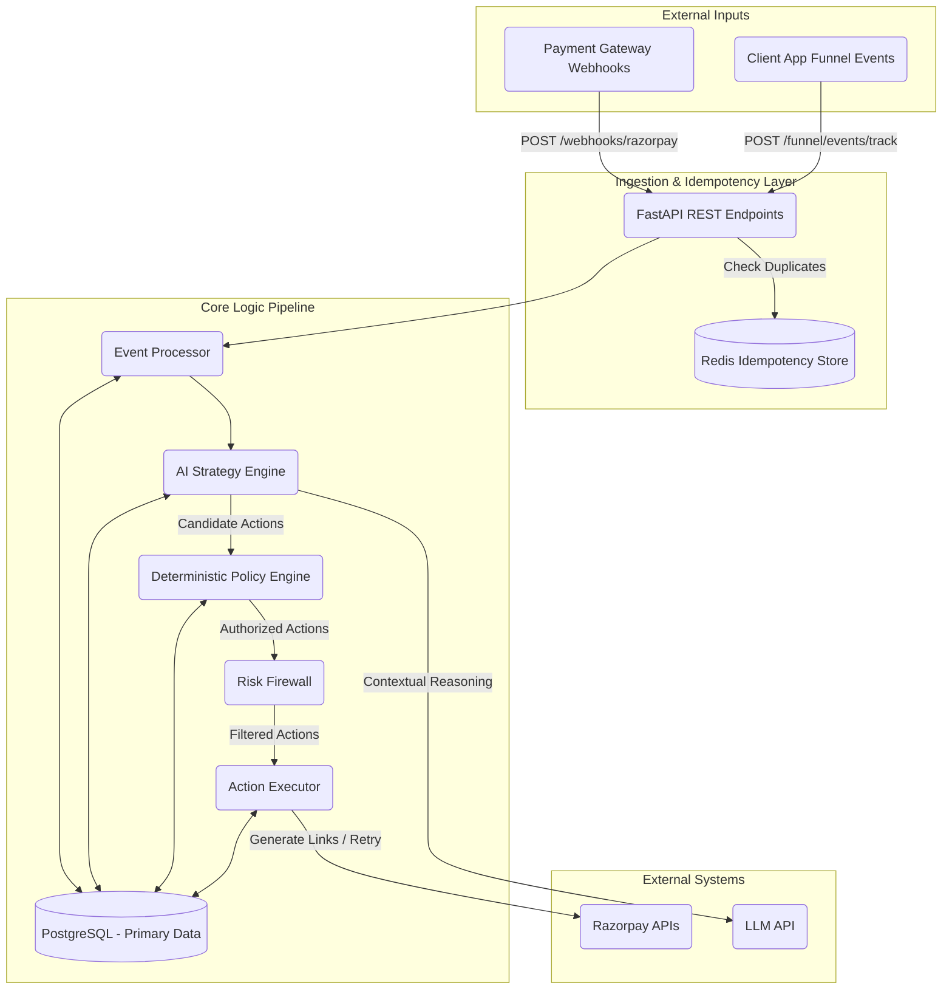

<h1 align="center">RecoverFlow</h1>

<p align="center">
  <strong>An AI-native Revenue Recovery Control Plane</strong>
</p>

---

## 🛑 Problem Statement

Currently, merchants rely on **reactive retries** (dumbly hitting the payment gateway until it works) or **blind discounts**. These legacy systems lack context, treat all customers the same, and often run afoul of frequency limits or anger high-value users.

## 💡 The Solution: Autonomous & Policy-Driven Recovery

**RecoverFlow** shifts the paradigm from reactive retries to **proactive, policy-driven interventions**. 

It acts as an autonomous agent that sits between the merchant and the payment gateway. When a webhook signals a failed payment, RecoverFlow intercepts it, enriches it, and deploys machine learning to decide the absolute optimal recovery strategy (e.g., immediate retry, delayed retry, human intervention, or automated discount offering)—all while being tightly constrained by a deterministic Risk Firewall.

---

## 📜 System Architecture

RecoverFlow is designed with a "Safety-First" architecture. While machine learning and LLMs power reasoning, strategy formulation, and content generation, they are explicitly sandboxed. Every action proposed by the AI must pass through a strict Policy Engine and Risk Firewall before being executed against the real world via external payment gateways.



> **Deep Dive:** For a comprehensive overview of the core components, data flow, and backend architecture, please refer to the detailed [System Design Document](system_design.md).

---

## ✨ Key Features

- **Intelligent Inference Pipeline:** Uses XGBoost and Logistic Regression to predict the recoverability score and recommend the optimal intervention.
- **Explainable AI (XAI):** Employs an LLM Reasoning Layer (OpenAI/Gemini) to generate human-readable explanations for *why* an action was chosen.
- **Deterministic Risk Firewall:** Safety is paramount. Every AI recommendation is strictly vetted against frequency, transaction, and behavioral constraints before execution.
- **Budget-Aware Optimization:** Allocates promotional discounts using a greedy knapsack algorithm to maximize ROI without burning through the merchant's margin.
- **Counterfactual Simulation Engine:** Allows merchants to dry-run new policies on historical data to see the financial impact *before* deploying to production.
- **Full-Stack Observability:** A Next.js Control Tower dashboard that visualizes the Revenue Leak Funnel and tracks the real-time status of every single recovery case.

---

## 🛠️ Technology Stack

- **Backend Core:** Python 3.12, FastAPI
- **Databases:** PostgreSQL 16 (Relational state), Redis 7 (Task Queues & Caching)
- **Background Workers:** ARQ (Async Redis Queues)
- **Machine Learning:** Scikit-Learn, XGBoost, Joblib, PuLP
- **Frontend:** Next.js 14 (App Router), React, Tailwind CSS
- **Infrastructure:** Docker & Docker Compose

---

## 🚀 Quickstart Guide

Getting RecoverFlow running on your local machine is designed to be frictionless. No manual database setup or complex dependency chains required.

### Prerequisites
- [Docker Desktop](https://www.docker.com/products/docker-desktop/) installed and running.
- Git.

### 1. Clone & Configure
```bash
git clone https://github.com/RazzGourav/RecoverFlow.git
cd RecoverFlow

# Copy the example environment variables
cp .env.example .env
```
*(Note: The default `.env.example` comes pre-configured with a mock LLM provider and mock Razorpay secrets so it runs perfectly out of the box).*

### 2. Boot the System
```bash
docker compose up --build -d
```
Docker Compose will automatically:
- Spin up PostgreSQL and Redis.
- Wait for the databases to become healthy.
- Run Alembic migrations to construct the database schema.
- Boot the FastAPI backend, the three ARQ background workers, and the Next.js frontend.

### 3. Access the Platforms
- **Dashboard UI:** [http://localhost:3000](http://localhost:3000)
- **API Swagger Docs:** [http://localhost:8000/docs](http://localhost:8000/docs)

---

## 🧪 Testing the System

### Run the Test Suite
The codebase is heavily tested. To execute the unit and integration tests inside the running API container:
```bash
docker compose exec api pytest -q
```

### End-to-End Simulation
To observe the entire pipeline working live, simulate a failed payment webhook from Razorpay:
```bash
# This will inject a mock webhook into the system
docker compose exec api python scripts/simulate_webhook.py --id my-test-event-1 --secret test_webhook_secret_123
```
Watch the worker logs to see the AI inference engine and Risk Firewall process the event:
```bash
docker compose logs -f worker
```

---

## 📊 Benchmark Results

Measured on 100 held-out cases (`data/processed/test.csv`, fixed seed 42). Every number below is computed live by `scripts/run_final_benchmark.py` through the real ML inference → Risk Firewall → Policy Engine pipeline. No hardcoded probabilities or fabricated baselines.

| Metric | Retry Baseline | Rules Baseline (5% Discount) | RecoverFlow (AI Optimal) |
|---|---|---|---|
| **Cases Processed** | 100 | 100 | 100 |
| **Action Cost (₹)** | ₹0.00 | ₹61,220.58 | ₹0.00 |
| **Expected Recovery (₹)** | ₹9,47,468.71 | ₹9,20,231.50 | ₹9,47,468.71 |
| **Net Recovery (₹)** | ₹9,47,468.71 | ₹8,59,010.92 | ₹9,47,468.71 |

> **Reproducibility:** Running `docker compose exec api python /app/scripts/run_final_benchmark.py` produces identical live results.
