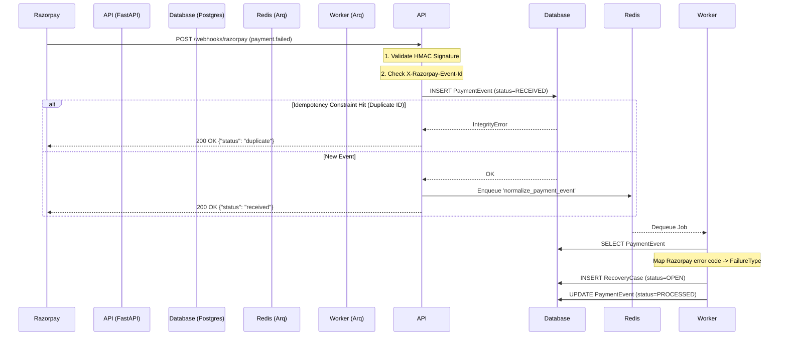

# docs/architecture/

Architecture documentation for RecoverFlow.

See the ASCII diagram in [README.md](../../README.md#system-architecture) for the high-level system view.

### Phase 1: Webhook Ingestion & Event Flow

This diagram illustrates how raw payment failures are ingested from the provider and normalized into actionable `RecoveryCase` records.

