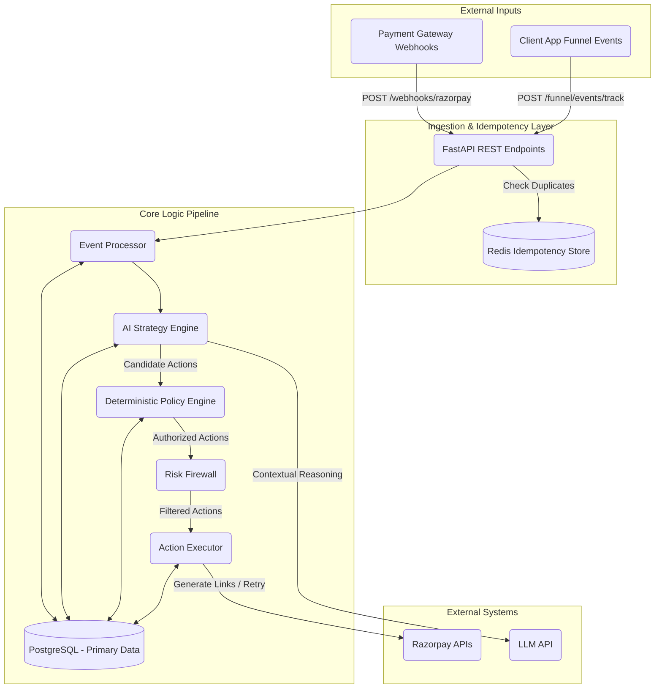

# RecoverFlow - System Design & Architecture

## 1. System Overview
RecoverFlow is an AI-powered Revenue Recovery Control Plane. It autonomously handles failed payments and involuntary churn by orchestrating intelligent retry schedules, generating payment links, and dispatching communication—all guarded by a strict deterministic policy engine and risk firewall.

The system is designed with a "Safety-First" architecture. While LLMs (Large Language Models) power the reasoning, strategy formulation, and dynamic content generation, they are explicitly sandboxed. Every action an LLM proposes must pass through a strict Policy Engine and Risk Firewall before being executed against the real world via external payment gateways (e.g., Razorpay).

## 2. Architecture Diagram

## 3. Core Components

### 3.1. Ingestion & Idempotency Layer
Built with **FastAPI** and **Redis**. All incoming webhook requests from external providers (like Razorpay) are intercepted by an Idempotency Middleware. It hashes the payload and stores it in Redis with an expiration time. If a duplicate webhook arrives, it is immediately dropped, preventing double-processing and duplicate case creation.

### 3.2. AI Strategy Engine (Machine Learning & LLMs)
- **Predictive Modeling**: Uses XGBoost / Scikit-Learn models trained on historical data to predict the `Recoverability Score` (probability of a successful recovery) for each candidate action (e.g., Retry, Send Payment Link, Offer Discount).
- **Budget Optimization**: If a merchant has a fixed budget for recovery (e.g., spending limits on discounts or communication costs), the engine uses linear programming (PuLP) to optimize the expected recovery yield within the given budget.
- **LLM Reasoning**: Uses LLMs to generate a human-readable explanation of *why* an action was chosen, explaining the underlying ML probabilities and risk scores. This provides auditability and transparency.

### 3.3. Deterministic Policy Engine
The absolute source of truth for authorization. Merchants configure policies (e.g., "Never auto-retry payments above $500", "Maximum 3 contacts per 72 hours"). The ML model proposes candidate actions, but the Policy Engine evaluates them against these hardcoded rules. If an action violates a rule, it is downgraded from `AUTONOMOUS` to `AWAITING_HUMAN` (Escalation) or `BLOCKED`.

### 3.4. Risk Firewall
A defense-in-depth layer. Even if the merchant's policy allows an action, the Risk Firewall evaluates systemic risks (e.g., detecting anomaly loops, extreme transaction frequencies, or potential fraud patterns). It can forcefully override and block actions.

### 3.5. Action Executor & Integrations
A modular integration layer using the Factory Pattern. The executor takes `APPROVED` actions and dispatches them to the relevant external system (e.g., Razorpay API). It handles transient network failures via retries and implements a strict internal state machine (PENDING -> EXECUTING -> EXECUTED / FAILED) to guarantee at-least-once or at-most-once semantics.

## 4. Data Flow: End-to-End Recovery

1. **Failure Occurs**: A customer's subscription renewal fails. Razorpay sends a `subscription.charged.failed` webhook.
2. **Ingestion**: The API receives the webhook, verifies the signature, and checks Redis for idempotency.
3. **Case Creation**: A `RecoveryCase` is created in PostgreSQL.
4. **AI Inference**: The AI Engine evaluates the customer's funnel context, segment, and failure reason, generating a set of `CandidateAction`s ranked by expected value.
5. **Policy & Risk Check**: The top-ranked action is checked against the Merchant's `Policy` and the `RiskFirewall`.
6. **Execution**: If approved, the Action Executor makes an API call to Razorpay (e.g., generating a one-click payment link).
7. **Audit Trail**: Every decision, probability score, policy rule triggered, and API response is logged in the `audit_events` table for the Failure Center and Replay Lab.

## 5. Technology Stack
- **Backend Framework**: Python, FastAPI
- **Database**: PostgreSQL (SQLAlchemy ORM, Alembic Migrations)
- **Caching & Idempotency**: Redis
- **Background Tasks**: ARQ (Async Redis Queue)
- **AI & ML**: Scikit-Learn, XGBoost, Pandas, PuLP (Optimization), LLMs (via LangChain / LiteLLM)
- **Frontend**: Next.js, React, Tailwind CSS, Lucide Icons, Recharts
- **Containerization**: Docker & Docker Compose
